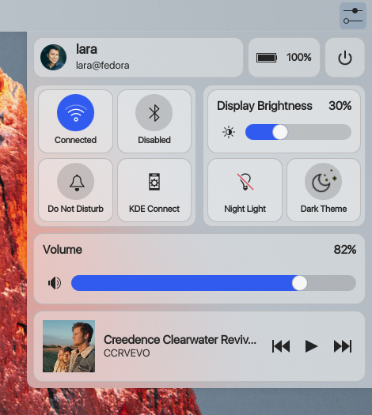

# KDE Control Station

A modern configuration center for KDE plasma based on the awesome [kde_controlcentre](https://github.com/Prayag2/kde_controlcentre) by [Prayag2](https://github.com/Prayag2/)

## Dependencies
- KDE Plasma >= 6.0
- Packages: `plasma-nm`, `kdeplasma-addons`, `plasma-pa`
- KDE Connect

## Easy Installation
#### KDE Store (Preferred way)
1. Right click on the desktop
2. Click on "Add Widgets"
3. Click on "Get New Widgets"
4. Click on "Download New Plasma Widgets"
5. Search for "KDE Control Station"
6. Click on "Install" and you're done!

## Usage
1. Right click on the desktop.
2. Click "Add New Widgets"
3. Search for "KDE Control Station"
4. Drag and drop to your desired place.

## License
[GPLv3](https://www.gnu.org/licenses/gpl-3.0.en.html)
